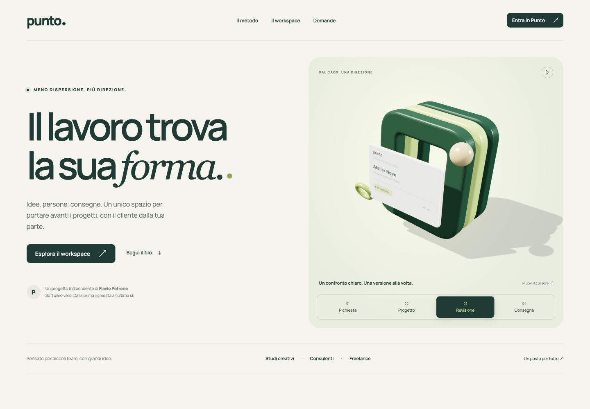
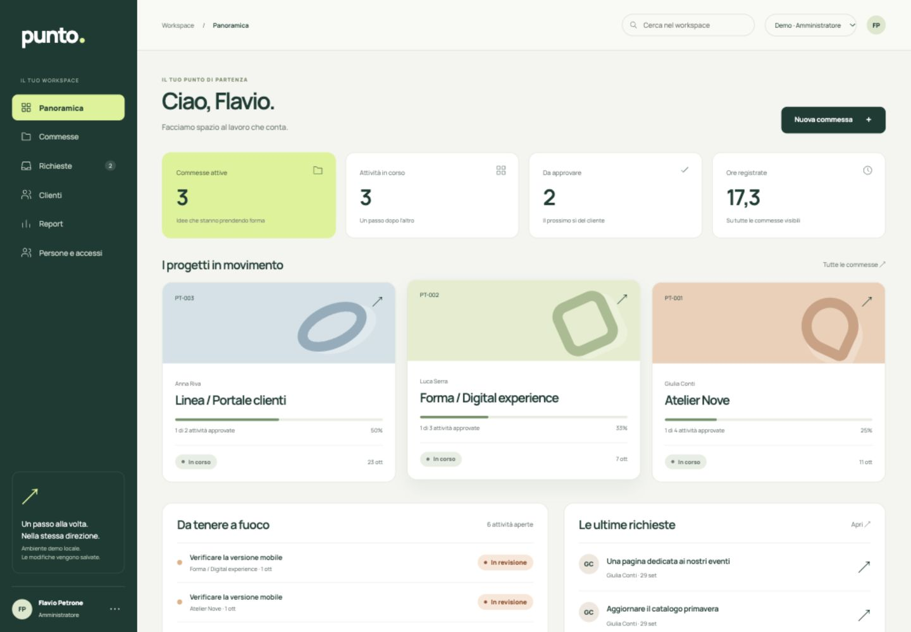

# Punto

**Il lavoro trova la sua forma.**

Un sito di presentazione con una scena 3D originale e un gestionale per piccoli studi e professionisti. Dal brief del cliente alla consegna approvata: richieste, commesse, attività, tempo e revisioni nello stesso workspace.

Progetto personale dimostrativo di **Flavio Petrone**. Identità, persone e commesse di esempio sono inventate. Il software esegue operazioni reali e salva i dati sul server.




## Il percorso completo

1. Il **cliente** invia una richiesta con descrizione e priorità.
2. L’**amministratore** la trasforma in commessa, con responsabile, scadenza e budget di tempo.
3. Il **team** lavora sulle attività, registra i minuti e invia una revisione.
4. Il **cliente** commenta, approva o richiede modifiche.
5. Il team carica una consegna PDF o immagine. Ogni caricamento ha un numero di versione.
6. La commessa può essere completata quando tutte le attività e l’ultima consegna sono approvate.

Il report usa i dati registrati, con esportazione CSV. Lo storico collega ogni operazione alla persona che l’ha effettuata.

## Cosa dimostra il progetto

- **Backend PHP**: sessioni, autorizzazioni sul server, API JSON, validazione, transazioni, upload privati, controllo delle modifiche concorrenti.
- **Database relazionale**: 12 tabelle con chiavi esterne, vincoli univoci e indici. Schema condiviso MySQL/SQLite.
- **JavaScript**: interfaccia del gestionale senza framework, ricerca, moduli, dialoghi, gestione degli errori e navigazione per commessa.
- **3D e movimento**: geometrie, materiali, luci e ombre in Three.js; animazioni coordinate con GSAP. Nessun video usato per simulare il 3D.
- **Progettazione dell’interfaccia**: identità originale, layout responsive, contrasto tra presentazione editoriale e workspace operativo.

Il frontend usa la stessa API nei tre ruoli. Nascondere un pulsante non costituisce il controllo di accesso: i permessi sono verificati anche dal backend.

## Avvio rapido in locale

Requisiti: **PHP 8.2+** con PDO, `pdo_sqlite`, `mbstring`, `fileinfo`, `gd` con WebP e `zip`. Versione di sviluppo: PHP 8.4. Per MySQL serve anche `pdo_mysql`.

```sh
git clone https://github.com/flavio-petrone/punto.git
cd punto
php bin/setup.php --demo
sh bin/serve.sh
```

Apri [127.0.0.1:8894](http://127.0.0.1:8894/). Dalla presentazione entra nel workspace e scegli **Studio**, **Team** o **Cliente**. Il cambio ruolo serve a provare il percorso completo. Le modifiche rimangono nel database.

L’avvio rapido crea un database SQLite locale. Le credenziali dell’amministratore vengono generate e scritte in `storage/accesso.txt`, escluso da Git. L’accesso rapido demo è disponibile **solo con `APP_ENV=demo` e richieste provenienti dal loopback**.

Per cambiare porta: `PUNTO_PORT=8895 sh bin/serve.sh`.

### Installazione con MySQL

Crea un database dedicato vuoto e un utente con permessi limitati a quel database. Copia `config.example.php` in `config.php`, configura DSN, utente e password, poi esegui l’installazione:

```sh
cp config.example.php config.php
# Modifica config.php con i parametri del tuo database.
# Per una demo locale imposta APP_ENV su demo.
php bin/setup.php --demo
sh bin/serve.sh
```

Il programma rifiuta database non vuoti e installazioni esistenti. Non converte automaticamente una precedente installazione SQLite. Per un’installazione senza dati demo, vedi [Installazione](docs/INSTALLAZIONE.md).

## Struttura

```text
app/             API, autenticazione, dominio e accesso al database
database/        Schema SQL relazionale
public/          Unica cartella da esporre sul server web
  assets/        Interfaccia, scena 3D, font e librerie locali
bin/             Installazione, avvio, backup, ripristino e build asset
tests/           Collaudo HTTP su database temporanei
docs/            Architettura, installazione e risultati dei test
storage/         Dati privati, esclusi da Git
```

Le librerie frontend sono incluse per poter avviare il progetto senza Node.js. Per ricrearle dalle versioni fissate nel lockfile:

```sh
npm ci --ignore-scripts
npm run build
```

## Test

```sh
python3 tests/integration.py
```

Per verificare anche il driver MySQL, usa un **database di test dedicato e vuoto**:

```sh
PUNTO_TEST_MYSQL_DSN='mysql:host=127.0.0.1;port=3306;dbname=punto_test;charset=utf8mb4' \
PUNTO_TEST_MYSQL_USER='punto_test' \
PUNTO_TEST_MYSQL_PASSWORD='password-del-database-di-test' \
python3 tests/integration.py
```

La suite crea una copia temporanea del codice, un server HTTP locale e sessioni distinte. Non usa la configurazione o il database della demo. Se il database MySQL indicato contiene tabelle, si ferma senza modificarlo. Dopo il test, quel database contiene i dati del collaudo: per una nuova esecuzione indica un nuovo database vuoto.

Risultati e limiti: [TEST.md](docs/TEST.md). Modello dei dati e permessi: [ARCHITETTURA.md](docs/ARCHITETTURA.md).

## Ambito

Punto è una dimostrazione completa del flusso di una piccola commessa, non un servizio SaaS già gestito per il pubblico. Non include pagamenti, fatturazione, firma elettronica, email automatiche o autenticazione a due fattori. Il 3D è nella presentazione; il gestionale privilegia leggibilità e rapidità.

**GitHub Pages non esegue PHP.** Per ospitare il progetto completo serve un server PHP e un database. Document root, HTTPS, permessi e backup sono descritti nella guida di installazione. La pubblicazione del repository non pubblica automaticamente un’istanza del gestionale.

## Fonti e licenze

Il design e la scena 3D sono originali. Three.js e GSAP sono usati direttamente; questo repository non contiene esportazioni da Spline o Higgsfield. Non contiene codice, dati o documenti di aziende per cui lavora l’autore.

Codice del progetto: [LICENSE](LICENSE). Librerie e font conservano le proprie licenze: [THIRD_PARTY.md](docs/THIRD_PARTY.md). Il codice è pubblicato come progetto di portfolio; la disponibilità su GitHub non implica una licenza open source o diritti di rivendita.
