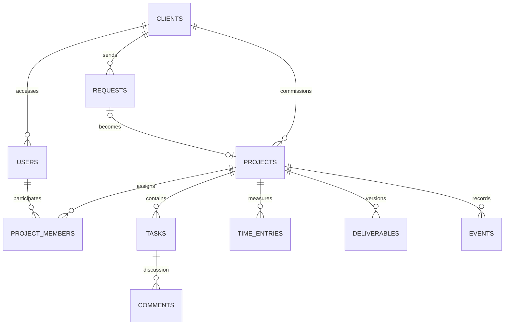

# Architettura e decisioni

Punto separa la presentazione pubblica (`index.php`) dal workspace (`app.php`). Il workspace è una shell HTML con JavaScript; ogni lettura o modifica passa da `api.php`. Il dominio usa PDO con query preparate e un database relazionale.

## Modello dei dati

`schema_migrations` registra la versione dello schema; `login_attempts` conserva temporaneamente gli hash degli indirizzi IP per limitare i tentativi di accesso. Le scadenze sono date ISO; i timestamp degli eventi sono UTC, convertiti nell’interfaccia. Budget e tempi sono interi in minuti.

## Permessi

| Operazione | Amministratore | Team | Cliente |
|---|---|---|---|
| Vedere commesse | Tutte | Solo assegnate | Solo del proprio cliente |
| Creare clienti/accessi/commesse | Sì | No | No |
| Inviare richieste | Per un cliente | No | Per sé |
| Accogliere richieste | Sì | No | No |
| Attività, tempi, upload | Tutte le commesse attive | Solo assegnate | No |
| Commentare | Sì | Solo assegnate | Solo proprie |
| Approvare attività/consegne | No | No | Solo proprie |
| Report ed esportazione | Tutte | Solo assegnate | No |
| Completare o archiviare | Sì | No | No |

La rubrica del team comprende solo i clienti delle commesse assegnate. Il cliente non riceve note interne della rubrica né le singole registrazioni di tempo. Vede budget e avanzamento delle proprie commesse. Il prototipo è per **uno studio**, con separazione per cliente: non è un SaaS multi-tenant con organizzazioni indipendenti.

## Flusso e coerenza

- Conversione richiesta → commessa in una transazione; una richiesta non può generare due commesse.
- Le attività passano da `todo` a `doing`, quindi a `review`. Soltanto il cliente le porta a `done` o richiede di riprenderle.
- Versione incrementale su richieste, attività, commesse e consegne. Un salvataggio basato su una versione precedente riceve HTTP 409.
- Un blocco sulla riga della commessa serializza chiusura, creazione attività, tempo e revisioni. L’API ricontrolla lo stato dentro la transazione.
- Completamento possibile solo con tutte le attività approvate e ultima consegna approvata. L’archiviazione è distinta dal completamento.
- File e righe di consegna sono associati a revisioni immutabili. Se la transazione fallisce dopo l’upload, il nuovo file viene rimosso.
- Nessuna cancellazione definitiva dall’interfaccia: la chiusura e l’archiviazione preservano lo storico.

## Protezioni implementate

Sessioni HTTP-only e SameSite=Lax, ID rigenerato all’accesso; scadenza per inattività di due ore; CSRF su tutti i POST; hash delle password con `password_hash`; limiti dei tentativi di login; escaping dei contenuti nell’interfaccia. Le risposte dell’API non sono memorizzabili in cache. CSP same-origin, frame non consentiti e sniffing MIME disattivato.

Gli allegati sono fuori dalla document root. Il download verifica prima la sessione e la commessa. MIME verificato con Fileinfo, immagini decodificate e ricodificate WebP, limite 5 MB / 12 MP. I PDF hanno controllo MIME e intestazione, ma **non sono sottoposti a scansione antivirus**. In un servizio destinato a utenti esterni serve una pipeline di scansione dedicata.

Gli errori inattesi vengono registrati sul server e non espongono query o credenziali al browser. L’export neutralizza le celle CSV che potrebbero essere interpretate come formule.

## Presentazione e accessibilità

Three.js costruisce geometrie locali e texture canvas; non carica modelli o script remoti. Il movimento si ferma fuori dallo schermo e nelle schede inattive. La densità di pixel è limitata per contenere il costo grafico. `prefers-reduced-motion`, pulsante pausa e composizione CSS alternativa mantengono la pagina utilizzabile senza movimento o WebGL.

Il workspace usa controlli HTML nativi, etichette, dialoghi modali e messaggi di errore. I cambi di stato hanno pulsanti espliciti: non dipendono da trascinamento o hover. Non è stata eseguita una certificazione WCAG o una verifica completa con screen reader.

## Compromessi espliciti

Il progetto mantiene PHP e JavaScript senza framework per rendere visibili query, permessi e flussi. Per uno studio piccolo è leggibile e avviabile senza toolchain; per carichi maggiori servono paginazione, query aggregate più efficienti, coda per elaborazioni e monitoraggio. Il report attuale esegue aggregazioni per commessa. Non ci sono aggiornamenti in tempo reale: la pagina si aggiorna dopo le operazioni e al cambio sezione. I conflitti sono segnalati, non risolti automaticamente.

La password si cambia dall’account; il recupero via email e la revoca centralizzata di tutte le sessioni non sono implementati. Lo storico è applicativo, non un registro probatorio antimanomissione. Il backup è amministrativo via CLI, contiene dati privati e non è cifrato dal programma.
